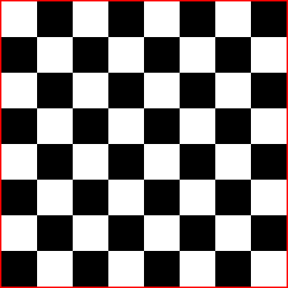

## Énoncé

On cherche ici à écrire un programme qui génère une image `SVG` représentant un échiquier.
Ce programme sera constitué d’une double boucle générant l’affichage sur la sortie standard des cases de l’échiquier, à l’aide de la balise `SVG` rectangle.
La documentation de cette balise est [disponible ici](https://www.w3schools.com/graphics/svg_rect.asp).

Vous devez donc commencer par ajouter la possibilité de dessiner un rectangle à votre module `svg.py` en implémentant la fonction suivante :

```python
def genere_rectangle(top_left, width, height):
    """
    Retourne la chaîne de caractères correspondant à un élément SVG représentant un rectangle.
    """
    # TODO
    ...
```

Créez ensuite un programme `echiquier.py` générant un échiquier.

Voici un exemple du résultat attendu :



## Correction
<details markdown="1">
<summary>Cliquez ici pour révéler la correction.</summary>
Voici le code de correction pour la fonction du module `svg` générant un rectangle :

```python
def genere_rectangle(top_left, width, height):
    """
    Retourne la chaîne de caractères correspondant à un élément SVG représentant un rectangle.
    """
    # Les parenthèses permettent sont là seulement pour couper
    # la ligne en deux pour qu'elle ne soit pas trop longue
    return (
        f'<rect x="{top_left.x}" y="{top_left.y}" '
        f'width="{width}" height="{height}" />'
    )
```

Et voici le code de correction du programme principal `echiquier.py`:

```python
#!/usr/bin/env python3
"""Dessin d'un échiquier en SVG."""
import svg

# On définit la taille de notre image
BORDER_WIDTH = 2  # Doit être un multiple de 2
TAILLE_ECHIQUIER = 400  # Doit être un multiple de 8
TAILLE_CASE = TAILLE_ECHIQUIER // 8


def main():
    """Point d'entrée du programme."""
    # On démarre l'image SVG
    print(svg.genere_balise_debut_image(404, 404))

    # On commence par tout colorier en blanc
    # sinon l’image sera transparente
    # On ajoute un bord rouge
    # Le bord d'épaisseur 2 est dessiné 1 pixel à gauche et 1 pixel à droite du
    # point donné, donc on divise par 2 la taille du bord.
    print(svg.genere_balise_debut_groupe("red", "white", BORDER_WIDTH))
    print(
        svg.genere_rectangle(
            svg.Point(BORDER_WIDTH // 2, BORDER_WIDTH // 2),
            TAILLE_ECHIQUIER + BORDER_WIDTH,
            TAILLE_ECHIQUIER + BORDER_WIDTH,
        )
    )
    print(svg.genere_balise_fin_groupe())

    # Puis on ajoute des carrés noirs par-dessus
    print(svg.genere_balise_debut_groupe("none", "black", 0))
    for ligne in range(8):
        for colonne in range(8):
            if (ligne + colonne) % 2:
                top_left_x = colonne * TAILLE_CASE + BORDER_WIDTH
                top_left_y = ligne * TAILLE_CASE + BORDER_WIDTH
                print(
                    svg.genere_rectangle(
                        svg.Point(top_left_x, top_left_y), TAILLE_CASE, TAILLE_CASE
                    )
                )
    print(svg.genere_balise_fin_groupe())

    # On termine l'image SVG
    print(svg.genere_balise_fin_image())


if __name__ == "__main__":
    main()
```
</details>

## Exercices

- [Boucles for](/2-iterations/travaux-pratiques/05-convertisseur/exercices/01-boucles-for/index.html)
