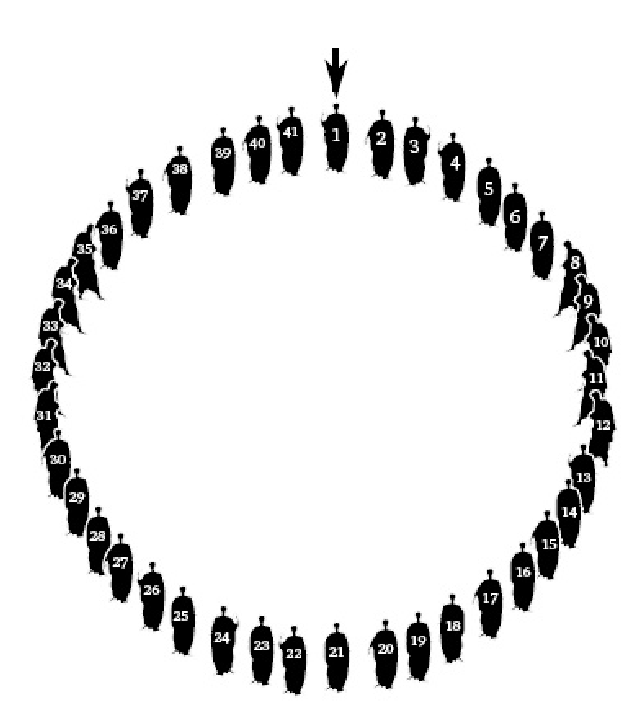
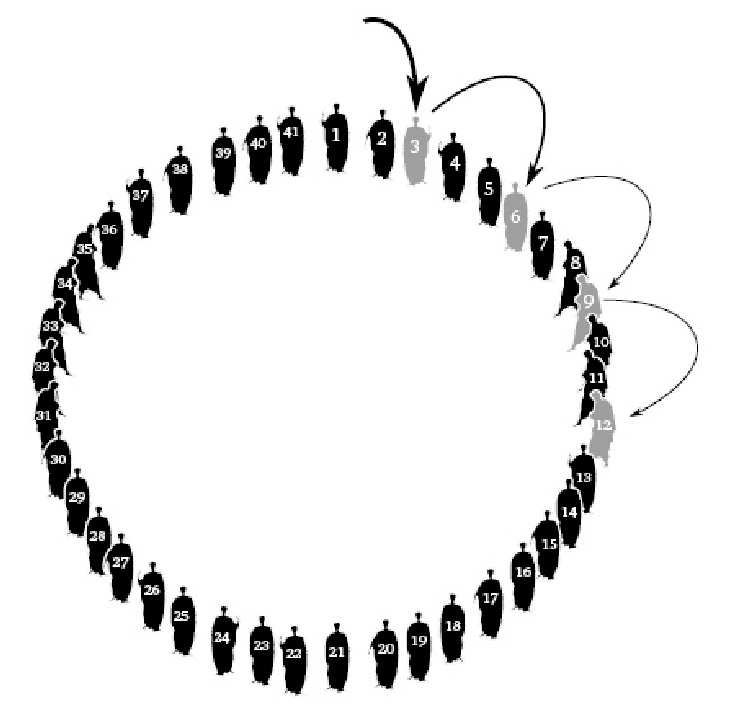
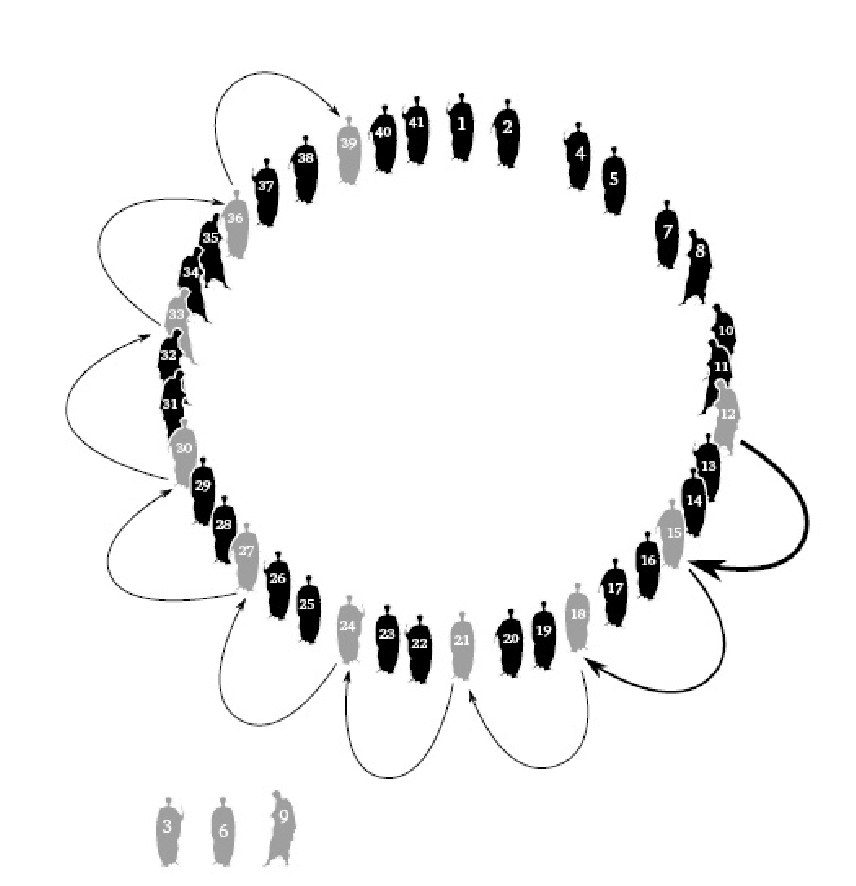
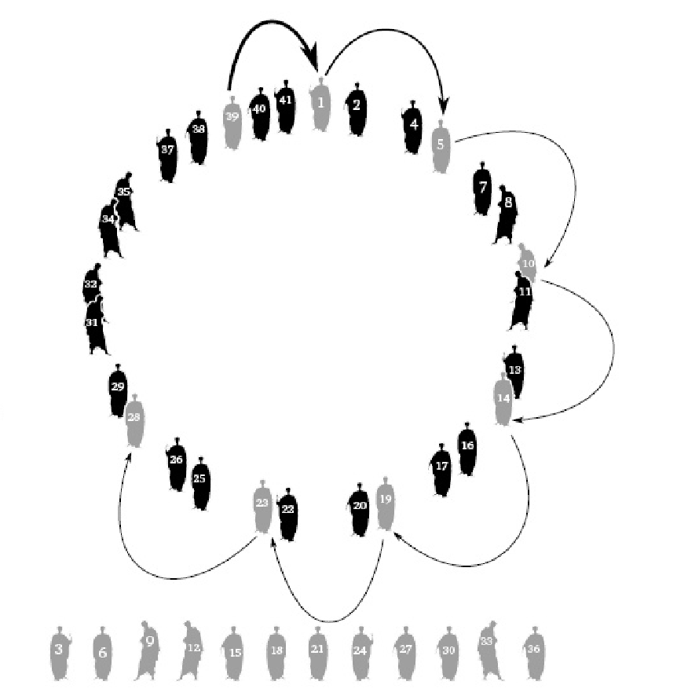
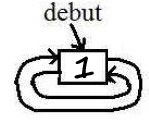
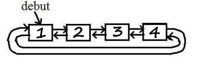

## Objectifs de ce TP

Ce TP a pour objectif de vous faire travailler les pointeurs.
On s'en servira aussi pour travailler les méthodes et outils de débogage.

**Les ressources de départ pour implémenter ce TP sont disponibles
dans le répertoire `base/TPs/alibaba/` du dépôt git de départ.**

## Le problème d'Ali Baba

Ali Baba se retrouve coincé dans la caverne au trésor avec 40 voleurs.
Tous les voleurs sont prêts à s'entretuer pour s'approprier le trésor.
Ali Baba imagine un stratagème qui lui permettra d'emporter une partie
du trésor sans aucun risque. Plutôt que de s'entretuer, il persuade les
40 voleurs de s'en remettre au hasard pour partager le trésor entre 2
heureux gagnants.

La méthode qu'il propose est la suivante (figures 1 à 4) :

-   41 papiers numérotés de 1 à 41 sont écrits par Ali Baba et choisis
	au hasard par chacune des 41 personnes présentes.
-   Les 41 personnes se placent alors en cercle dans l'ordre des numéros
	tirés.
-   Il est proposé que le chiffre 3 soit l'arbitre du hasard.
-   La 3ème personne de la liste est assommée, plutôt que tuée, par son prédécesseur
	dans la liste. Ainsi, même mécontente de son sort, elle n'attentera
	pas à la vie des 2 gagnants finaux ;
-   Puis de 3 en 3 en tournant autour du cercle, on désigne les perdants qui
	sont successivement assommés par leur prédécesseur ;
-   Les 2 personnes restantes se partageront le trésor.

Ali Baba, qui avait calculé à l'avance les numéros gagnants, s'était
arrangé pour récupérer les 2 papiers contenant les numéros gagnants. Il
avait proposé en cachette à un des 40 voleurs qui lui semblait le moins
sanguinaire l'attribution d'un numéro gagnant contre la promesse que ce
dernier n'attenterait pas à sa vie à la fin du jeu. A la fin du jeu
proposé, seuls Ali Baba et le voleur qu'il avait choisi restèrent
debout. Ils se partagèrent le trésor et s'enfuirent avant que les 39
perdants ne se réveillent.

 

## Travail à effectuer

On propose d'écrire un programme qui trouve les 2 numéros de places gagnantes.

### Fonctionnalités attendues

Vous devez compléter le programme `alibaba.c` pour :

-   créer et afficher la liste initiale des 41 numéros d'Ali Baba et des
	40 voleurs ;
-   appliquer la méthode d'Ali Baba pour éliminer petit à petit les
	perdants de la liste initiale, qui seront stockés dans une seconde
	liste ;
-   afficher la liste finale des perdants successifs ;
-   afficher enfin les deux numéros gagnants ;
-   libérer la mémoire.

### Module de liste doublement chaînée circulaire

Pour résoudre le problème, il est demandé d'implémenter un module de *liste
doublement chaînée circulaire*.

Les fonctionnalités à implémenter sont décrites dans l'entête `ldc.h`.
Il faudra donc implémenter dans le fichier `ldc.c` toutes ces fonctions.
On en donne un aperçu ci-dessous :
- `ldc_insere_fin` qui insère un nouvel élément en fin de liste ;
- `ldc_affiche` qui affiche les éléments d'une liste ;
- `ldc_taille` qui retourne le nombre d'éléments dans la liste ;
- `ldc_recupere_nieme` qui, étant donné un élément de départ appartenant à la liste, retourne celui placé `n` positions après lui ;
- `ldc_supprime` qui supprime un élément de la liste ;
- `ldc_libere` qui libère toute la mémoire associée à la liste.

Afin de vous aider à tester votre implémentation du module `ldc`, nous vous fournissons un programme de test `test_ldc.c`.
Ce programme de test est compilé vers le binaire `test_ldc` quand vous lancer `make`.
Vous devez donc ensuite lancer les tests en exécutant ce binaire : `./test_ldc`.

Vous **devez** également lancer `valgrind` sur votre programme `alibaba` pour vérifier que ce dernier libère correctement toute la mémoire allouée sur le tas.

### Extensions possibles

En option, on pourra tester le programme avec des variantes : autre
nombre de voleurs, autre incrément dans le cercle que le chiffre 3, ou
procéder dans le sens inverse des aiguilles d'une montre pour désigner
les perdants.
# Compétences

# Difficulté

:star:
