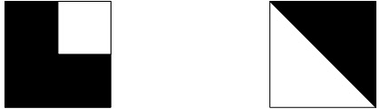

## Présentation

L'objectif de ce TP est de dérouiller votre pratique du C en implémentant un
ensemble de sous-programmes pour traiter des images. L'idée consiste à appliquer
des opérations, comme le tracé de cercles et de droites, le remplissage, le
pivotement ou retournement à une forme rectangulaire initialement vide pour
constituer des motifs simples (c.f. figure 1). Outre l'aspect dessin, il vous
faudra aussi pérenniser vos œuvres. Pour sa simplicité, on vous impose la
sauvegarde dans un fichier au format de fichier PPM. Enfin, pour retrouver
rapidement vos motifs, on vous demande aussi de réaliser des fonctions
permettant la gestion d'une bibliothèque de motifs, où chaque motif est associé
à une chaîne de caractères unique.


_Exemple de dessin : Gribouille l'émotif_

Les sous-programmes réalisant les opérations requises pour obtenir une
image sont regroupés en deux modules :

-   module `motif` : opérations de création et d'édition de motif;
-   module `biblio` : opérations de gestion d'une bibliothèque de
	motifs.

L'objectif de ce TP est de compléter ces deux modules et de tester
abondamment tous les ajouts réalisés. Pour y parvenir, vous serez amenés
à étudier et à manipuler les constructions suivantes du langage C et de
son environnement :

-   structures et énumérations;
-   allocation dynamique / libération de la mémoire;
-   manipulation de fichiers;
-   manipulation de chaînes de caractères;
-   conception modulaire.

**Les ressources nécessaires à l'implémentation de ce TP sont
disponibles dans le répertoire `base/TPs/gribouille/` du dépôt git de
départ.**

## Travail demandé

### Module `motif`

Le fichier d'entête `motif.h` spécifie l'ensemble des fonctions à réaliser. Il
est probable que vous n'ayez pas le temps de tout implanter. En fonction des
tests demandés et envisagés, certaines fonctions seront plus prioritaires que
d'autres. Nous vous conseillons donc de définir les fonctions que vous jugez les
plus prioritaires et de commencer par celles-ci.

Conseils algorithmiques :

-   Pour le tracé de droite, utiliser l'algorithme de Bresenham (cf.
	[Wikipédia](http://fr.wikipedia.org/wiki/Algorithme_de_tracé_de_segment_de_Bresenham)
	[^1]).
-   Pour le tracé des cercles, utiliser l'algorithme de Bresenham (cf.
	[Wikipédia](http://fr.wikipedia.org/wiki/Algorithme_de_tracé_d'arc_de_cercle_de_Bresenham)).
-   Pour tracer des arcs de cercle, on peut s'appuyer sur l'algo
	précédent. Il faut cependant identifier les octants de départ et
	d'arrivée et veiller à la progression de l'algorithme de Bresenham
	dans ces octants. Si la trigo vous fait peur, vous pouvez partir sur
	une version simplifiée ne tracant que des octants complets.
-   Pour le remplissage, utiliser un remplissage par diffusion (cf.
	[Wikipédia](http://fr.wikipedia.org/wiki/Algorithme_de_remplissage_par_diffusion))
-   Les fichiers PPM ("Portable Pixmap Format"  [^2]) devront respecter
	le format P6. Ce format PPM est très simple : il consiste en un
	entête au format texte spécifiant le type d'image (couleur ou noir
	et blanc) et ses dimensions, puis, ligne après ligne, au format
	binaire [^3], la suite des pixels de l'image en commençant par le
	coin supérieur gauche de l'image. Chaque pixel est codé sur 3 octets
	: un pour le rouge (R), un pour le vert (V) et un pour le bleu (B).
	([Plus de détails sur le format
	PPM](http://netpbm.sourceforge.net/doc/ppm.html))

### Module `biblio`

Le fichier d'entête `biblio.h` spécifie l'ensemble des fonctions à réaliser. Le
type `struct _biblio` est également à implanter comme bon vous semble.

Comme dans le module `motif`, toutes les fonctions n'ont pas la même
priorité. Par exemple, l'import et l'export de biblio sont inutiles tant
qu'on ne sait pas faire d'insertion de motifs. Pour le reste, à vous de
voir.

### Module `tests`

Ce module doit fournir une batterie de tests validant les différentes fonctions
implémentées. Chaque test devra être implanté dans une fonction séparée du main
et commenté sur son utilité (ex : Test unitaire validant le tracé de droite ou
test d'intégration réalisant l'ours gribouille). Notez que lorsqu'on dispose des
interfaces d'un module (prototypes des fonctions, types de données), il est tout
à fait possible de réaliser en parallèle les tests d'une fonction et son
implantation.

Pour les tests d'intégration, nous vous proposons plusieurs scénarii d'usage de
difficulté croissante (c'est-à-dire que les scénarii intègrent de plus en plus
de modules). A vous d'estimer le niveau de difficulté que vous pensez pouvoir
atteindre dans le temps imparti et de répartir le travail en conséquence.

#### Scénario 1: P'ticarré et triangle

Il s'agit de générer les deux motifs carrés de la figure 2 et de les exporter au
format PPM. A l'issu de votre test, les fichiers `triangle.ppm` et
`pticarre.ppm` contiendront ces motifs de 15 pixels de côté. Ce test minimaliste
sera réutilisé dans la séance de demain.



_Scénario 1 : p'ticarré et triangle._

#### Scénario 2: P'ticarré dans tous ses états

Récupérez le motif dans `pticarre.ppm` et faites lui subir tous les
retournements et pivotements possibles en prenant soin d'en garder une trace
(sous forme d'un fichier PPM).

#### Scénario 3: P'ticarré et triangle en vitrine

Faites entrer vos 2 motifs dans une bibliothèque et vérifiez que P'ticarré y est
bien.

#### Scénario 4: Gribouille

Rien à faire. Par bonté, on vous fournit les sources.

#### Scénario 5: Vol de vitrine camouflé par l'arrivée de P'tirond

Introduisez-vous dans la vitrine du scenario précédent pour en copier le
contenu. A partir de ces informations, créez une nouvelle vitrine. Pour cacher
votre forfait, veillez à y ajouter un nouveau motif: P'tirond.

#### Scénario 6: Vol libre

Vous n'aimez pas nos scénarii, ils ne sont pas assez compliqués...
Libre à vous d'en faire des plus intéressants!

## Annexe : en-tête proposée pour le module `motif`

```c
#ifndef __MOTIF_H
#define __MOTIF_H
#include <inttypes.h>

/* Type couleur
 * Contient une couleur en RGB, le rouge est sur l'octet de poids faible, le
 * vert celui en deuxieme position et le bleu celui en troiseme. le quatrieme
 * est sans effet. */
typedef uint32_t couleur;

/* Structure de donnees definisant un motif rectangulaire de lxh
 * pixels. Le champ valeur contient la couleur de chaque pixel. */
struct motif {
    uint16_t l; // largeur du motif
    uint16_t h; // Hauteur du motif
    couleur **valeur; // Contenu du motif dans un tableau l*h
};

/* Donne le sens de rotation pour une operation de pivotement. */
typedef enum _dir {
    d90,
    g90
} dir;

/* Donne l'axe de symetrie pour une operation de retournement. */
typedef enum _axe {
    hori,
    verti
} axe;

/* Definition d'un point en adresse relative. */
struct point {
    float x; // abscisse relative du point dans le motif : la valeur 1
             // correspond a l'indice min(l,h) dans l'image
    float y; // ordonnee relative du point
};

/* Definition d'une droite en adresse relative. */
struct droite {
    struct point depart; // point de depart
    struct point arrivee; // point d'arrivee
    couleur coul; // couleur de la droite
};

/* Definition d'un cercle en adresse relative. */
struct cercle {
    struct point centre; // point au centre du cercle
    struct point depart; // point de depart du trace
    float ang; // angle du trace en degre (valeur entre 0 et 360)
    couleur coul; // couleur du cercle
};

/* Alloue un motif de taille lxh et l'initialise avec la couleur fond
 * et renvoie un pointeur vers le motif alloue ou NULL en cas d'echec
 * d'allocation. */
extern struct motif *creer_motif(uint16_t l, uint16_t h, couleur fond);

/* Alloue et initialise un motif identique a celui pointe par src et
 * renvoie un pointeur vers ce motif.  */
extern struct motif *copier_motif(struct motif *src);

/* Initialise le motif pointe par m avec la couleur de fond fond. */
extern void init_motif(struct motif *m, couleur fond);

/* Libere la memoire utilisee par le motif pointe par m. */
extern void detruire_motif(struct motif *m);

/* Trace la droite relative pointe par d dans le motif pointe par
 * m. */
extern void tracer_droite(struct motif *m, struct droite *d);

/* Trace l'arc de cercle relatif pointe par arc dans le motif pointe
 * par m. */
extern void tracer_cercle(struct motif *m, struct cercle *arc);

/* Remplit par diffusion autour du point pointe par p le motif pointe
 * par m avec la couleur coul.  */
extern void remplir(struct motif *m, struct point *p, couleur coul);

/* Realise la rotation du motif pointe par m soit a droite soit a
 * gauche selon la valeur de la direction passee en parametre. */
extern void pivoter(struct motif *m, dir direction);

/* Realise un retournement du motif pointe par m selon l'axe passe en
 * parametre. */
extern void retourner(struct motif *m, axe axe);

/* Realise l'export du motif pointe par m au format PPM (P6) dans le
 * fichier chemin. */
extern void exporter_PPM(struct motif *m, const char *chemin);

/* Extrait un motif du fichier chemin au format PPM (P6) et renvoie un
 * pointeur sur ce motif. */
extern struct motif *importer_PPM(const char *chemin);

/* Debug purpose */
extern void afficher_motif(struct motif *m);

#endif
```

## Annexe : en-tête proposée pour le module `biblio`

```c
#ifndef _BIBLIO_
#define _BIBLIO_
#include "motif.h"
#include <inttypes.h>
#include <stdbool.h>

/* Type biblio
 * Une structure de donnees permettant de stocker une bibliotheque de motifs,
 * contenant pour chaque motif stocke : un motif et un tag associe (chaine de
 * caractere identifiant de maniere unique un objet).
 * Remarque: on declare ici le type biblio sans le definir. La definition du
 * type se fera dans biblio.c, ce qui permet de garantir l'encapsulation:
 * on ne peut acceder ou modifier une variable de type biblio que via les
 * fonctions definies dans biblio.h. En revanche, le type biblio ne peut
 * apparaitre dans les profils des fonctions et dans un code utilisant ce
 * module que sous forme d'un "pointeur vers biblio" (car la taille de la
 * structure elle-meme n'est pas connue).
 */
struct biblio;

/* Cree une nouvelle bibliotheque, initialement vide. */
extern struct biblio *creer_biblio(void);

/* Libere toute la memoire utilisee par la biblitheque pointee par
 * bib. */
extern void liberer_biblio(struct biblio *bib);

/*  Associe le motif pointe par m a la chaine de caracteres tag dans
 *  la bibliotheque pointee par bib.  Si la bibliotheque contenait
 *  deja une entree de cle "tag", l'association n'est pas realisee et
 *  la fonction retourne false. En cas d'insertion, le motif est
 *  egalement sauvegarde dans un fichier au format PPM.  */
extern bool inserer_biblio(struct biblio *bib, struct motif *m, const char *tag);

/* Retourne un pointeur vers le motif associe a la cle "tag" dans la
 * bibliotheque pointee par bib ou NULL si la cle est absente. */
extern struct motif *rechercher_biblio(struct biblio *bib, const char *tag);

/* Supprime l'entree de cle tag et detruit le motif associe si tag
 * est presente dans la bibliotheque pointee par bib, sans effet sinon. */
extern void supprimer_biblio(struct biblio *bib, const char *tag);

/* Sauvegarde le contenu de la bibliotheque pointee par bib dans le
 * fichier nomme path. */
extern void exporter_biblio(struct biblio *bib, const char *path);

/* Alloue une bibliotheque et l'initialise en fonction du contenu du
 * fichier de sauvegarde path.  Renvoie un pointeur vers cette
 * bibliotheque. */
extern struct biblio *importer_biblio(const char *path);

/* Debug purpose. */
extern void afficher_biblio(struct biblio *bib);

#endif
```

[^1]: Il est possible de complètement factoriser le code de tracé,
	moyennant de petites modifications

[^2]: man ppm

[^3]: man fputc

# Compétences


# Difficulté

:star:
