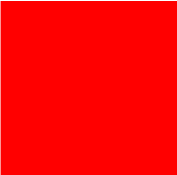
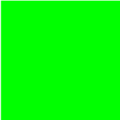
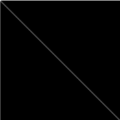
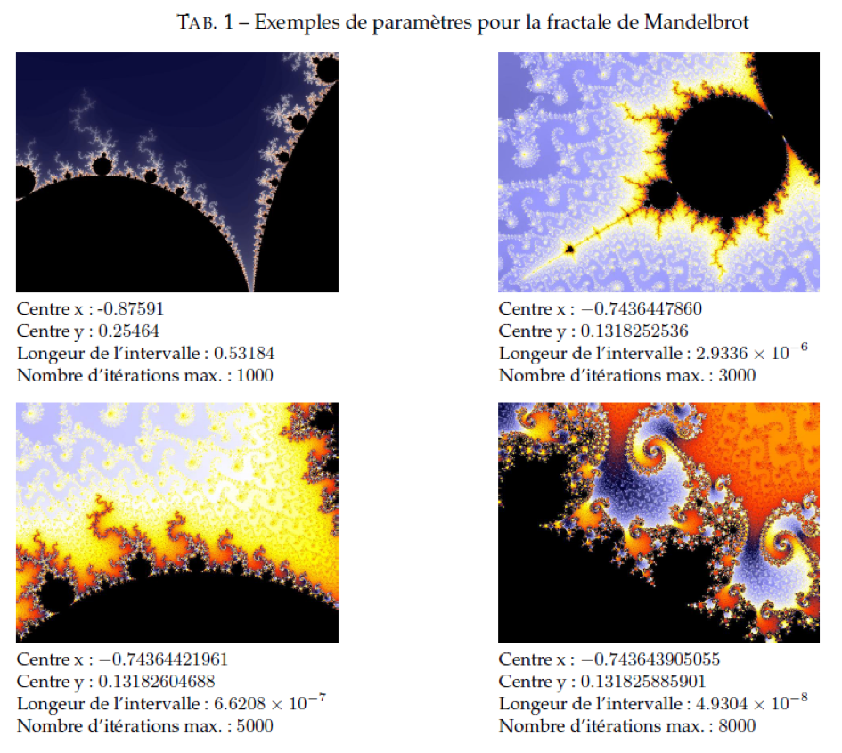

# Fractales de Mandelbrot

 </img>

## Présentation

Le but de cet exercice est de se familiariser avec quelques points de
base du langage C, à travers la mise en oeuvre de fractales de
Mandelbrot.

Les objectifs de ce sujet, du point de vue du langage C, sont les
suivants:

* Programmation modulaire ;
* Allocation dynamique ;
* Utilisation des arguments argc et argv de la fonction main ;
* Utilisation du préprocesseur C ;
* Ecriture dans un fichier ;
* Utilisation des types C99 ;
* Manipulation des opérateurs binaires `<<`, `>>`, `|`, `&`, ... ;
* Utilisation des `assert` ;
* Utilisation des fonctions de la bibliothèque `string.h` ;
* Utilisation du debugger (`gdb` ou  `ddd`) et de `valgrind`.

Nous vous demandons d'utiliser des types C99 pour vos variables :
* `uint8_t`, `uint16_t`, `uint32_t`, `uint64_t` ;
* `int8_t`, `int16_t`, `int32_t`, `int64_t` ;
* `bool`.

**Les ressources de départ nécessaires pour implémenter ce TP sont
disponibles dans le répertoire `TPs/base_mandelbrot/` du dépôt git de
départ.**

## Préambule : création d'une image PPM

Pour pouvoir dessiner les fractales et les afficher à l'écran, le
programme principal permettra de générer un fichier au format d'image
PPM en sortie. Les fonctions `fopen`, `fwrite` (ou `fputc`) et `fclose`
devront être utilisées pour la création de ce fichier de sortie.

### Représentation interne de l'image

Il est demandé pour des raisons pédagogiques de représenter l'image
générée comme un tableau d'entiers non signés de 32 bits. Une image
sera donc représentée dans votre projet par une variable de type
`uint32_t *`.  Chaque élément de ce tableau est composé de 4 octets,
dont 3 serviront à stocker la valeur d’une composante couleur (R, V ou
B) d’un pixel. Le dernier octet sera inutilisé.

C'est à vous de définir comment stocker ces composantes de couleur
dans un entier 32 bits et comment les récupérer.

L'exemple qui suit considère qu’une variable de type `uint32_t` contient
dans ses trois octets de poids faible trois valeurs représentant des
intensités de couleurs dans l’ordre R, V, B (du poids le plus fort
vers le poids le plus faible).

Exemple :

```c
/* Initialisation du premier pixel de l'image avec une
couleur codée en hexadécimal. image est ici un tableau de
uint32_t. */
image[0] = 0x00F788AA;

/* Composante R de la couleur du pixel : 0xF7 soit 247 en décimal */
/* Composante V de la couleur du pixel : 0x88 soit 136 en décimal */
/* Composante B de la couleur du pixel : 0xAA soit 170 en décimal */
```

Vous devrez écrire, en fonction de la convention de stockage des
couleurs que vous aurez définie, des primitives permettant de lire et
d'écrire les composantes de couleur R, V et B dans un entier `uint32_t`,
en vous appuyant sur les opérateurs binaires du langage C.

### Création du fichier PPM

Le format PPM (Portable Pixel Map) consiste en un en-tête spécifiant
le type d’image (ex : couleur ou noir et blanc) et ses dimensions,
puis la suite des pixels de l’image ligne par ligne, chaque pixel
étant codé sur 3 octets : un pour le rouge (R), un pour le vert (V) et
un pour le bleu (B).  Il est possible d’aller voir à l’adresse
http://netpbm.sourceforge.net/doc/ppm.html ou simplement le « man ppm
» pour plus de détails sur ce format. Néanmoins, dans le cadre du
travail demandé, le fichier devra commencer par l’en-tête suivant :

```
P6
LARGEUR HAUTEUR
255
```

où `LARGEUR` et `HAUTEUR` sont la largeur et la hauteur de l’image au
format texte et 255 la valeur maximale de chaque couleur (rouge, vert
ou bleu).

Notez bien que, comme l'indique la description du format P6, l'entête
du fichier doit être écrit au format texte, alors que la suite des
pixels de l'image devra être écrite au format binaire dans le fichier.

Implémenter une fonction `creer_fichier_PPM` ayant comme paramètres la
variable image `uint32_t *image`, la largeur et la hauteur de l'image
codées en `int32_t` et le nom du fichier de sortie codé sous forme de
chaîne de caractères.

### Test et visualisation du fichier PPM

Le format d’images PPM est visualisable par beaucoup de visionneurs,
comme par exemple `eog` (eye of gnome) sous linux/Unix. Si vous
souhaitez convertir vos fichiers PPM en images JPG, vous pouvez
utiliser la commande `ppmtojpg`, avec l’option `--smooth=30` pour
lisser le résultat.

Vous devrez fournir un ensemble de tests qui démontrent que la
génération d'image se passe bien. Ce module peut en effet être testé
indépendamment du reste du projet : vous pouvez par exemple construire
des structures de données représentant des images particulières « à la
main » (par exemple : image carrée de couleur, dessin de diagonale)
dans un fichier de test et vérifier que la génération de fichier PPM
par un appel à `create_image` correspond bien au résultat attendu.  Par
exemple, la génération des images ci-dessous permet de vérifier la
bonne prise en compte de la couleur :

<figure>
  
  
  
  <figcaption>Fichiers rouge.ppm, vert.ppm et bleu.ppm</figcaption>
</figure>

Celle-ci teste l'orientation de l'image :

<figure>
  
  <figcaption>diagonale.ppm</figcaption>
</figure>

## Programme : fractales de Mandelbrot

### Principe général

Le fonctionnement de calcul pour ce type de fractale est le suivant :

* On définit un plan complexe associant à chaque point (i, j) de
l’image un nombre complexe z0 (ex : pour le point (0,1), la valeur
complexe 0 + 1i).
* On définit une fonction complexe f(z) ainsi que, pour chaque point
(i,j) et donc chaque z0 associé, la suite zn+1 = f(zn).
* On calcule ensuite les termes zn de la suite jusqu’à ce que
|zn| atteigne une valeur de sortie choisie, ou que n atteigne une certaine profondeur donnée.
* Si la profondeur est atteinte, la suite ne diverge pas; tandis que
  si la valeur du module de sortie est atteinte, la suite diverge.
* Pour colorier l’image, on affiche pour chaque point divergent une
  couleur associée à la profondeur atteinte.

### Fractale de base de Mandelbrot

On se propose tout d'abord de tracer une image représentant une partie
de l’ensemble de Mandelbrot avec la fonction `f(z) = z2 + z0`

Autrement dit, cet ensemble de Mandelbrot est l’ensemble des points z0
du plan complexe tels que la suite : `zn+1 = zn2 + z0` ne diverge pas.

Dans cette partie, on demande de produire une image en noir et blanc
de l’ensemble : un point est colorié en noir s’il appartient à
l’ensemble, et en blanc sinon. Les intervalles à utiliser sont [−2.2 ;
0.8] pour les abscisses, et [−1.5 ; 1.5] pour les ordonnées. L’image
fournie devra être aux dimensions 300*300 pixels : il vous faudra donc
établir une application injective qui, à toutes coordonnées (i,j)
appartenant à [0 ; 300] x [0 ; 300] associe un point de coordonnées
(x,y) appartenant à [-2.2 ; 0.8] x [-1.5 ; 1.5].

Pour déterminer si un point diverge ou converge, il est possible de
s’arrêter après 1000 itérations : si la suite n'a pas divergé au bout
de 1000 itérations, on considèrera (peut-être à tort!) qu'elle
converge. Enfin, pour vérifier si la suite diverge à chaque itération,
on raisonnera sur les parties réelles et imaginaires du point z. En
effet, il a été démontré que si `R(z)2 + I(z)2 ≥ 4`, alors la suite `zn+1
= zn2 + c` diverge.

### Tracé d’autres fractales de Mandelbrot

On souhaite désormais pouvoir spécifier d’autres valeurs pour le
sous-ensemble à visualiser, ainsi que pouvoir fournir des tailles
d’images différentes. Comme on souhaite ne pas avoir de déformation
dans l’image, les paramètres sont les suivants :

* Résolution horizontale (`RESOL_X`) et résolution verticale
  (`RESOL_Y`) de l’image ;
* Coordonnées X et Y du centre du sous-ensemble (centre = `CENTRE_X +
  i CENTRE_Y`) ;
* Longueur de l'intervalle horizontal du sous-ensemble (`SPAN_X`) ;
* Nombre d’itérations maximal au bout duquel on s'arrête (`NB_ITER_MAX`).

Le nombre d’itérations maximal ne peut pas être connu à l’avance, mais
est dépendant soit du zoom sur le sous-ensemble, soit de l’intervalle
horizontal représenté. Quelques exemples d’images sont donnés
dessous. Si vous voulez en faire d’autres, à vous de trouver une
valeur suffisamment grande, mais pas trop pour ne pas alourdir
inutilement le calcul.

A partir de maintenant, le programme Mandelbrot s'exécutera de cette
façon :

```
./mandelbrot <config_file> <outfile>
```

On lira les paramètres dans le fichier de configuration `config_file`.
Le fichier `outfile` est le nom du fichier PPM de sortie.

Il vous est demandé d'enregistrer ces paramètres à l'intérieur d'une
même structure de données que vous définirez. La valeur des différents
champs de cette structure, comme la résolution horizontale par
exemple, sera définie en fonction des données lues depuis le fichier
de configuration `config_file`.

Plusieurs fichiers de configurations sont fournis dans l'archive «
`configs.tar.gz` ». Les fichiers intitulés «
`config_fractale_1_nx.txt` » correspondent aux fractales de Mandelbrot
étudiées dans cette partie. Le format de ces fichiers est le suivant :

```
RESOL_X
RESOL_Y
CENTRE_X
CENTRE_Y
SPAN_X
NUMERO_FRACTALE # Utilisé uniquement  dans la partie 3
NB_ITER_MAX
COLOR ou COLOR1 ... COLORn # Utilisé uniquement  dans la partie 2.4
								*
								COLOR_STEP
```

Nota bene : les 3 dernières lignes des fichiers serviront
ultérieurement pour la mise en couleur des fractales.

### Utilisation de couleurs pour le tracé de la fractale

De manière à rendre les dessins plus jolis, on souhaite dans cette
section utiliser des couleurs pour le tracé de la fractale. L’approche
est la suivante : on définit un petit nombre P de couleurs (par
exemple jaune (`#FFFF00`), vert (`#00FF00`), bleu (`#0000FF`) et rouge
(`#FF0000`)), appelées paliers, et une valeur N correspondant au nombre
de couleurs entre deux paliers, de manière à obtenir une transition
entre ces deux paliers. À partir de ces informations, il faut générer
toutes les couleurs correspondantes (au nombre de `(P − 1) * N`). Entre
autres, il faut bien faire attention à diviser les paliers selon les 3
composantes R, V et B.

Une fois toutes les couleurs obtenues, il suffit de colorier un point
divergeant avec la couleur ayant pour indice le numéro de l’itération
ayant fait diverger la suite (modulo le nombre de couleurs total).

Implémenter cette fonctionnalité.

<figure>
  
  <figcaption>Exemples de paramètres pour la fractale de
Mandelbrot</figcaption>
</figure>

## Extensions possibles

### Autres fonctions de génération f(z)
Fonctions `f(zn)` à implémenter :

- `f(z) = sin(z) x z0` (fonction Mandelbrot numérotée 2 dans les
	fichiers de configurations)
- `f(z) = z2 + h`, avec `h = - 0.39492 + 0.59568i` (fonction Julia
	numérotée 3 dans les fichiers de configurations)
- `f(z) = cos(z) x h`, avec `h = 4.72675 + 0.001456i` (fonction
	Julia numérotée 4 dans les fichiers de configurations)

3 fichiers de configurations sont fournis dans l'archive
`configs.tar.gz` pour tester ces fonctions :

- `config_fractale_2_n1.txt`
- `config_fractale_3_n1.txt`
- `config_fractale_4_n1.txt`

NOTA BENE : On pourra utiliser `complex` (C99) pour les calculs sur
les nombres complexes liés à ces autres fonctions.

# Compétences


# Difficulté

:star:
