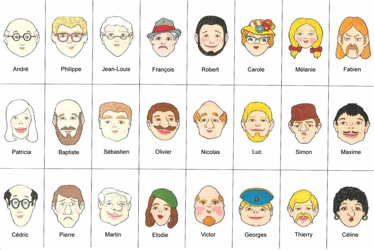

_Figure 1: Liste des suspects du jeu *Qui est-ce*._

**Les ressources nécessaires pour implémenter ce TP sont disponibles à
partir du répertoire `base/TPs/quiestce` du dépôt git de départ.**

Outre l'approfondissement de la pratique du C et la manipulation de
pointeurs, un des objectifs pédagogiques de ce TP réside dans
l'utilisation des opérateurs bit-à-bit standards pour implémenter un
module de gestion d'ensembles. Ce module sera utilisé pour implémenter
une intelligence artificielle sommaire pour le jeu de société *Qui
est-ce*.

La section [1](#sec:ensemble) décrit le principe de manipulation d'ensembles
d'éléments à l'aide d'opérateurs bit-à-bit et spécifie le contenu du
module `ensemble` qui l'implémente. La section [2](#sec:quiestce)
détaille l'implémentation d'une intelligence artificielle pour le jeu
*Qui est-ce*, qui utilisera le module `ensemble`. Enfin, la section
[3](#sec:organisation) donne les consignes pour développer ce TP.

## Manipulation d'ensembles sous la forme de champs de bits

On considère dans cette partie des ensembles finis d'au plus `N`
éléments. Un ensemble est ici codé sous la forme d'un entier non-signé,
et les éléments qui le composent sont numérotés de `0` à `N-1`. Ainsi,
l'élément numéro `k` appartient à l'ensemble `E` si le `k`-ième bit de
l'entier représentant `E` vaut 1.

Prenons l'exemple des ensembles dont le cardinal n'excède pas 16
éléments. On peut coder un ensemble de ce type sur un `uint16_t`. On
définira le type `ensemble_t` de cette façon:

```c
typedef uint16_t ensemble_t;
```

Les éléments qui composent cet ensemble sont numérotés de `0` à `15`.
Ainsi, l'ensemble défini comme suit en notation binaire[^1]:

```c
ensemble_t pairs = 0b0101010101010101;
```

est composé des éléments `0`, `2`, `4`, `6`, `8`, `10`, `12` et `14`.
Par contre, l'élément `5` ne fait pas partie de l'ensemble défini par la
variable `pairs`, puisque le 5-ième bit de `pairs` vaut 0.

On demande dans cette partie d'implémenter le module `ensemble`[^2] qui
propose les fonctionnalités suivantes:

-   Création d'un ensemble initialement vide ;
-   Création d'un ensemble initialement plein ;
-   Calcul du cardinal d'un ensemble ;
-   Union de deux ensembles ;
-   Intersection de deux ensembles ;
-   Complémentaire d'un ensemble ;
-   Ajout d'un élément à un ensemble ;
-   Retrait d'un élément d'un ensemble.

L'entête de ce module est décrit en annexe. Le fichier `ensemble.h`
correspondant est fourni dans l'archive de départ. Vous pouvez l'étendre
**mais en aucun cas le modifier**. En effet, la suite de tests qui vous
est fournie utilise les fonctions dont les prototypes figurent dans ce
fichier.

## Implémentation d'une IA pour le jeu de société *Qui est-ce*

Le principe du jeu *Qui est-ce* est simple: il s'agit de trouver parmi
une liste d'individus celui ou celle qui a été choisi(e) par le joueur
adverse en l'interrogeant sur les caractéristiques physiques de
l'individu concerné. Nous allons, pour ce TP, simplifier ce jeu et
distinguer deux rôles distincts:

-   L'enquêteur (l'ordinateur): il pose des questions au témoin sur
    l'apparence physique du coupable. Ces questions sont forcément
    tournées de manière à pouvoir y répondre par \"oui\" ou par \"non\".
-   Le témoin (le joueur): il répond aux questions posées à l'enquêteur
    par \"oui\" ou par \"non\".

Le jeu s'arrête lorsque le coupable a été trouvé, ou lorsque l'enquêteur
détecte que le témoin a menti.

### Gestion des suspects

Un suspect est défini par un nom et un ensemble d'attributs physiques.
Le module `suspect` définit la structure de données représentant un
suspect et implémente la gestion de la liste des suspects.

L'ensemble des attributs physiques sera représenté par une variable de
type `ensemble_t`. C'est à vous de définir les attributs suivants, sous
la forme de constantes C, dans le fichier suspect.h:

```c
    /* Genre */
    #define HOMME                   //TODO: Donner une valeur!
    #define FEMME                   //TODO: Donner une valeur!

    /* Pilosité */
    #define MOUSTACHE               //TODO: Donner une valeur!
    #define BARBE                   //TODO: Donner une valeur!

    /* Coiffure */
    #define COIFFURE_CHAUVE         //TODO: Donner une valeur!
    #define COIFFURE_LONG           //TODO: Donner une valeur!
    #define COIFFURE_COURT          //TODO: Donner une valeur!

    /* Couleur cheveux */
    #define CHEVEUX_NOIRS           //TODO: Donner une valeur!
    #define CHEVEUX_CHATAINS        //TODO: Donner une valeur!
    #define CHEVEUX_BLANCS          //TODO: Donner une valeur!
    #define CHEVEUX_ROUX            //TODO: Donner une valeur!
    #define CHEVEUX_BLONDS          //TODO: Donner une valeur!

    /* Accessoires */
    #define LUNETTES                //TODO: Donner une valeur!
    #define CHAPEAU                 //TODO: Donner une valeur!
```

Certains attributs sont exclusifs: par exemple, on ne peut pas être
chauve et avoir les cheveux longs à la fois.

La liste des suspects doit être implémentée comme une liste double
chainée sans sentinelle: chaque suspect possède un pointeur vers le
suspect précédent et le suspect suivant dans la liste. Le module
`suspect` implémentera les fonctionnalités suivantes:

-   Création/Destruction d'un suspect (nom, attributs physiques) ;
-   Création/Destruction d'une liste de suspects, initialement vide ;
-   Ajout d'un suspect à la liste ;
-   Suppression d'un suspect de la liste ;
-   Affichage de la liste de suspects.

### Déroulement du jeu

Au démarrage du jeu, le joueur choisit un personnage dans la liste des
suspects comme étant le coupable que devra trouver l'ordinateur.
L'ordinateur va ensuite poser une série de questions sur les attributs
physiques du coupable, auxquelles le joueur devra répondre en tapant
\"o\" ou \"n\" en ligne de commande.

La série de questions devra suivre un ordre aléatoire: elle devra être
différente chaque fois qu'on relance le jeu. On utilisera ici aussi une
variable de type `ensemble_t` pour représenter les questions qui ont
déjà été posées par l'ordinateur. Initialement, cet ensemble est vide.
Il est ensuite mis à jour pour:

-   Se souvenir des questions qu'on a déjà posé, pour ne pas les reposer
    ensuite ;
-   Eviter de poser des questions inutiles. Par exemple, si le joueur
    répond \"o\" à la question *Le coupable est-il un homme?*, il ne
    sert à rien de poser la question *Le coupable est-il une femme* plus
    tard.

En fonction de la réponse du joueur, l'ordinateur met à jour la liste
des suspects en retirant de la liste les personnes qui ne remplissent
pas les critères physiques correspondants. Le jeu s'arrête quand le
coupable a été trouvé ou quand toutes les questions ont été posées sans
trouver de coupable.

## Consignes de travail

Nous fournissons une suite de tests pour vous aider à développer les
modules `ensemble` et `suspect`. Pour la lancer, tapez `make check` dans
votre terminal. Bien entendu, cette commande n'est valable que si vous
utilisez le Makefile fourni par les enseignants. Nous vous encourageons
à aller voir ce que fait `make check` et à étoffer cette suite de tests
avec des cas plus tordus qui vous poseraient problème.

L'archive de départ est composée des fichiers suivants:

-   `Makefile`: il compile la coquille vide de départ et génère
    l'exécutable `quiestce`. Il contient aussi les règles nécessaires à
    l'exécution de la suite de tests (`make check`) ;
-   `ensemble.h`, `ensemble.c`: module de gestion des ensembles ;
-   `suspect.h`, `suspect.c`: module de gestion des suspects ;
-   `jeu.h`, `jeu.c`: module contenant les fonctionnalités pour jouer à
    *Qui est-ce*.

La liste des suspects officiels du jeu *Qui est-ce* est illustrée en
figure 1. Votre TP devra fonctionner sur cette liste de
suspects.

## Annexes

### Fichier `ensemble.h`

```c
    /* Retourne un nouvel ensemble initialement vide. */
    extern ensemble_t ensemble_vide(void);

    /* Retourne un nouvel ensemble initialement plein. */
    extern ensemble_t ensemble_plein(void);

    /* Retourne le cardinal de l'ensemble b */
    extern uint16_t ensemble_cardinal(ensemble_t b);

    /* Retourne vrai si l'élément de numéro numero_elt appartient à
     * l'ensemble b, faux sinon */
    extern bool ensemble_appartient(ensemble_t b, uint16_t numero_elt);

    /* Retourne un nouvel ensemble correspondant à l'union des ensembles
     * e1 et e2. */
    extern ensemble_t ensemble_union(ensemble_t e1, ensemble_t e2);

    /* Retourne un nouvel ensemble correspondant à l'intersection des
     * ensembles e1 et e2. */
    extern ensemble_t ensemble_intersection(ensemble_t e1, ensemble_t e2);

    /* Retourne un nouvel ensemble correspondant au complémentaire de
     * l'ensemble e. */
    extern ensemble_t ensemble_complementaire(ensemble_t e);

    /* Ajoute l'élément de numéro numero_elt à l'ensemble e. */
    extern void ensemble_ajouter_elt(ensemble_t *e, uint16_t numero_elt);

    /* Retire l'élément de numéro numero_elt de l'ensemble e.*/
    extern void ensemble_retirer_elt(ensemble_t *e, uint16_t numero_elt);

    /* Affiche l'ensemble e sous la forme: "suite de 0 et de 1 (val
       décimale)".  */
    extern void ensemble_afficher(const char *msg, ensemble_t e);
```

### Fichier `suspect.h`

#### Structures de données

```c
    /* Suspect du jeu Qui est-ce. */
    struct suspect {
        char *nom;
        ensemble_t attributs;
        struct suspect *suiv;
        struct suspect *prec;
    };

    /* Liste doublement chainée de suspects. */
    struct liste_suspects {
        uint16_t nb_suspects;
        struct suspect *tete;
        struct suspect *queue;
    };
```

#### Primitives de gestion des suspects

```c
    /* Retourne un nouveau suspect initialisé en fonction des paramètres
     * nom et attributs. */
    struct suspect *creer_suspect(const char *nom, ensemble_t attributs);

    /* Créé une nouvelle liste de suspects, initialement vide. */
    struct liste_suspects *creer_liste_suspects(void);

    /* Détruit la liste de suspects passée en paramètre. */
    void detruire_liste_suspects(struct liste_suspects **l);

    /* Ajoute le suspect s en fin de la liste de suspects l. */
    void ajouter_suspect(struct liste_suspects *l, struct suspect *s);

    /* Retire le suspect s de la liste de suspects l. */
    void retirer_suspect(struct liste_suspects *l, struct suspect *s);

    /* Affiche les noms de tous les suspects de la liste l. */
    void affiche_liste_suspects(struct liste_suspects *l);
```

[^1]: L'entête `0b` permet de définir une constante écrite en base 2. On
    aurait aussi pu définir la variable `pairs` comme étant égale à
    `21845` (base 10) ou encore `0x5555` (base 16)

[^2]: mais il faudra quand même le faire tout seul!

# Compétences


# Difficulté

:star:
